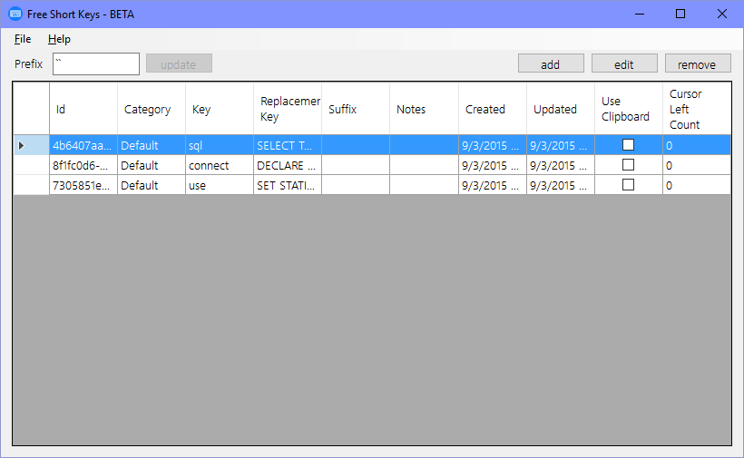

# Free Short Keys

A open free short keys application

*Please note that because this is still in BETA there are some rough edges around the keys used for the prefix and suffix, we are working on these and will publish an update when done*

## Install

Head over to [https://clickonce.binary-stuff.com/](https://clickonce.binary-stuff.com/) and download the latest click once deployment of this application.

## A Quick Tour

The feature set covers what you would find in most short key apps with a couple others that just make sense.

### Landing Window

The opening window is very basic and just lists all your short keys

- You can change the prefix for your short key binds
- You can also then Edit or Remove a short key by selecting one and clicking on the **edit** or **remove** buttons.
- Lastly you can add new short keys by clicking on the add button.

### Add/Edit Short Key

Next we'll take a look at the add/edit a short key window

- You can edit the category
	- The category is used to determine which file the short key is saved into (more on this later)
- You are able to set what the keys are that trigger your short key
	- At the moment this is limited to numbers and letters
	- Your key needs to be 2 or more characters long
- You can optionally add a suffix to the end of your short key 
- You get the option to have your replacement key pasted in with the clip board or typed out
	- If you want to use Special Keys you will need to leave this unchecked
- You then get the replacement key that you would like to use for the current short key
	- *Note that if you insert special keys they will insert into your replacement key textbox at the current location of the cursor*
- If you want to provide some notes for your short key you can do so
- We then have a feature that I haven't seen around yet that just feels right. If you check the **Save replacement key cursor position** check box then for the current save we will locate the cursor in the replacement text box and then automatically do left key presses when this short key is used to get back to that exact position.
	- Unlike other short key solutions when you have the clipboard paste mode on left arrows don't work. With our solution you are still able to get to your ideal place in the replacement text even when using the clipboard mode

#### Magic placeholders

There are a couple of placeholders that do magical things for you, they are listed below

| name | example | how it's used |
| --- | --- | --- |
| date | [date:yyyyMMdd] | If your short key is matched this placeholder will be replaced with the format specified after after the colon and does a C# equivalent *DateTime.Now.ToString(format)* |

### Context Menus

The File context menu has a couple options in it

- **Open Storage Path**, this is useful for if you want to copy the configuration and short key files to move them to another machine or share them with your friends
- **Log Keys (debug)**, this feature will write keys that are captured as part of trying to detect your short keys for replacement to a log file in the storage path.
	- You would use this for when your short key might not be working for some reason and would like the contributors of the project to take a look at what's being captured and why it's not working as expected
- **Flush Keys to Log**, the keys with the previous step are logged every 1 minute and only if the buffer is greater than 1000 characters. If you click on this context menu item the buffer will immediately be cleared and written to the log file.
	- You'd definitely want to do this if you are having issues as you wouldn't want to have to wait and or type out a lot of text just to get the debug info to us. So as soon as you reach the point where the short key doesn't work you can flush the buffer and send us the results.

### About Free Short Keys

The short keys app get's published to a click once site hosted in [Azure](http://r3f.co/1Q9blXl) with the aim being to provide a single place for a bunch of cool click once apps. Contributors to the project are in a bunch of places to give them credibility and publicity for the bits that they've done to help get free cool tools into the hands of others. 

